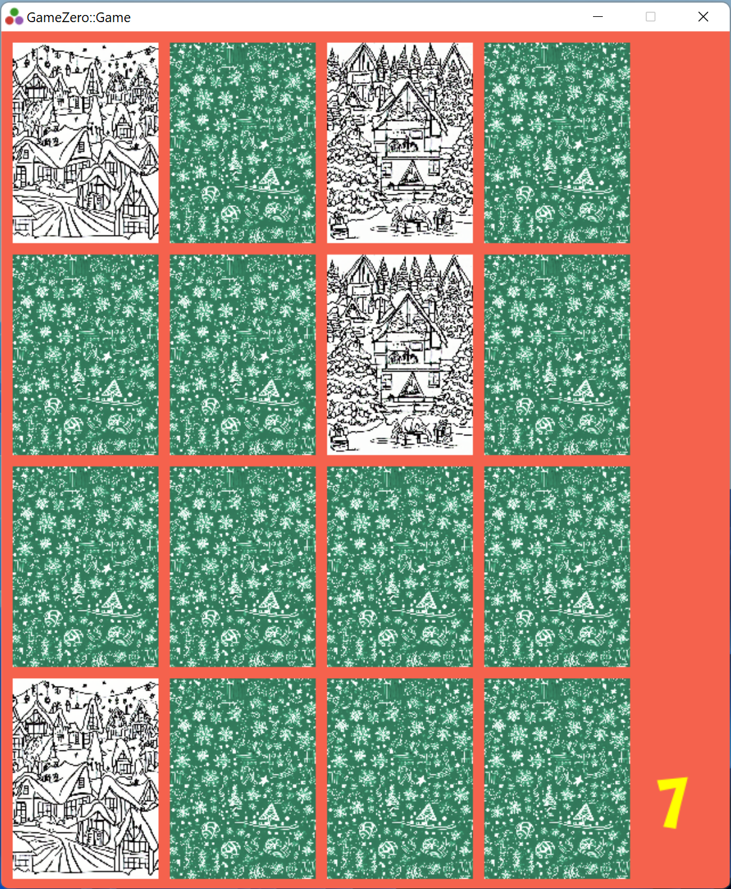

This is a simple holiday themed game, made with GameZero.jl. 

## Starting the game

First, fetch the code of the game from Github. 
```
git clone https://github.com/aviks/Holiday2022
```

Then, change the directory to where the source has been download. 
```
cd Holiday2022
```

Next, ensure all the dependencies are installed on your local machine 
```
julia --project=. -e "using Pkg; Pkg.instantiate(); Pkg.precompile()"
```

Finally, run the game
```
julia --project=. -e "using GameZero; GameZero.main()" game.jl
```

## Alternate way to start the game

Clone and cd to the source directory as before. Then start the Julia repl

```
PS C:\Users\me\games\Holiday2022> julia
               _
   _       _ _(_)_     |  Documentation: https://docs.julialang.org
  (_)     | (_) (_)    |
   _ _   _| |_  __ _   |  Type "?" for help, "]?" for Pkg help.
  | | | | | | |/ _` |  |
  | | |_| | | | (_| |  |  Version 1.8.4 (2022-12-23)
 _/ |\__'_|_|_|\__'_|  |  Official https://julialang.org/ release
|__/                   |

julia>
```

Then, in the Julia REPL, 

```
] activate .

] precompile

julia> using GameZero

julia>  rungame("game.jl")
```

## Playing the game

The aim of the game is to select identical pairs of cards. Each click on a face down card will turn it face up. 
Two cards can be turned face up at one time, after when they will automatically turn back to face down, unless 
they are identical, at which point they will remain face up till the end of the game. The game starts with 15
chances, and each pair of non-identical cards that are seen takes away one chance. Once the game reaches zero
chances, the player looses. If, however, all identical pairs are identified, the player wins. Once the game
finishes, a snowflake animation appears on the screen. Clicking the left mouse button restarts the game. 



## Video 

A video with example gameplay is here: https://www.youtube.com/watch?v=GC1W39R2hLs 

## Caveats

Tested with Julia 1.8 only
